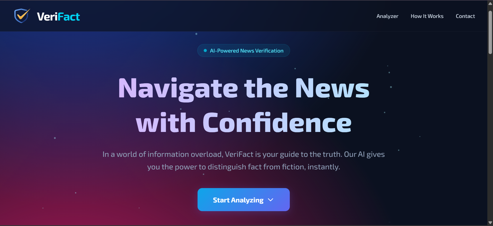
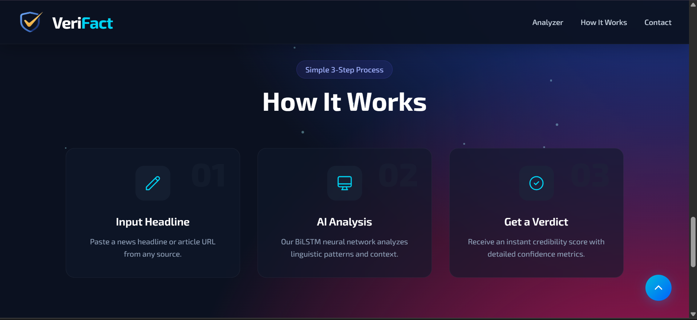
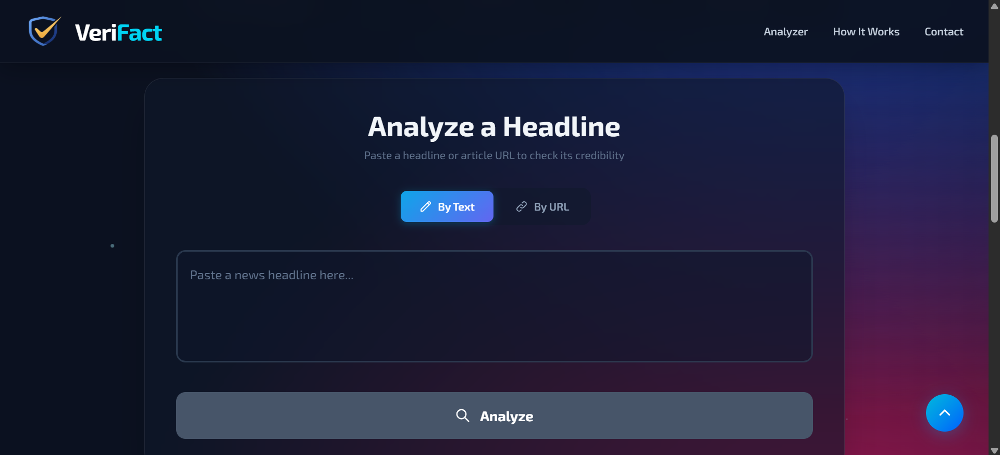
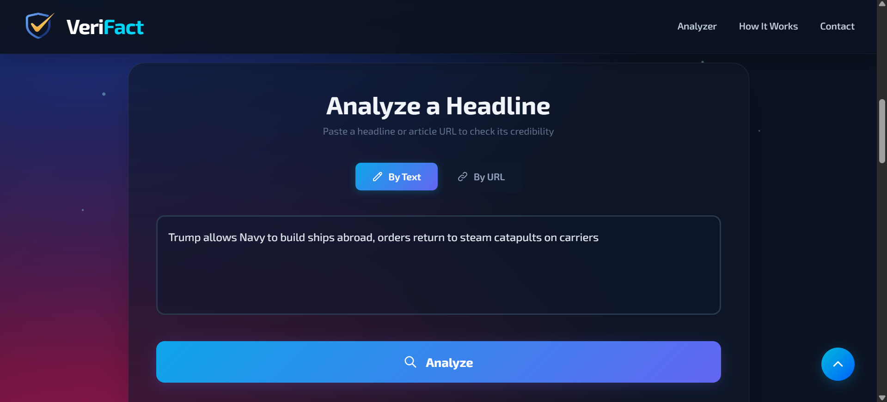
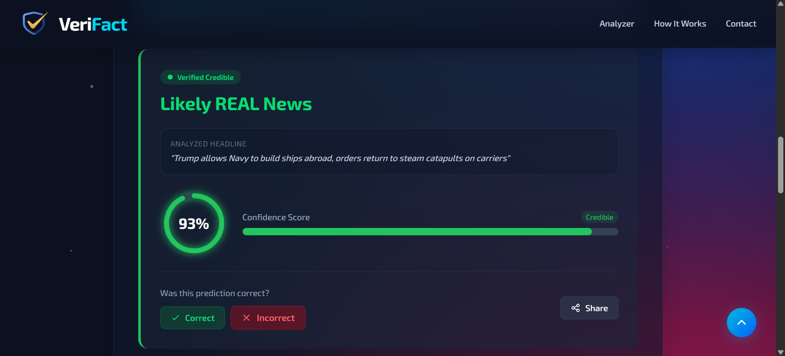
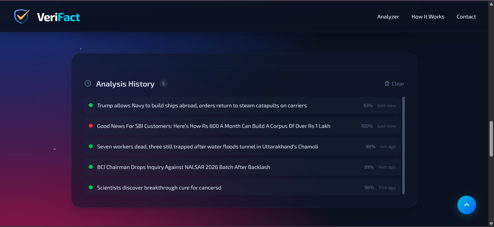
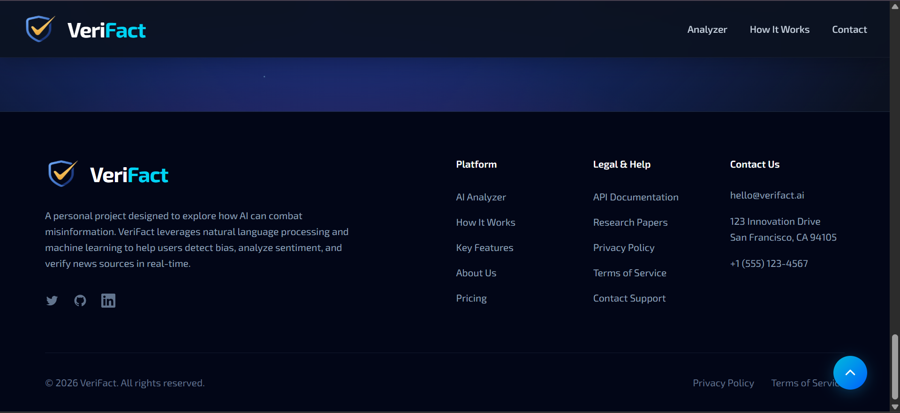

<div align="center">

# 🛡️ VeriFact — AI-Powered Fake News Detector


### Navigate the News with Confidence

A production-ready, full-stack web application that leverages a **Bidirectional LSTM (BiLSTM)** deep learning model to detect fake news headlines in real-time. Built with React, Node.js, and TensorFlow.js.

[](https://react.dev)
[](https://nodejs.org)
[](https://www.tensorflow.org/js)
[](https://tailwindcss.com)
[](https://vite.dev)
[](LICENSE)

[Features](#-features) · [Demo](#-quick-demo) · [Screenshots](#-screenshots) · [Getting Started](#-getting-started) · [Architecture](#-system-architecture) · [API Reference](#-api-reference) · [Contributing](#-contributing)

</div>

---

## 📋 Table of Contents

- [Features](#-features)
- [Quick Demo](#-quick-demo)
- [Screenshots](#-screenshots)
- [System Architecture](#-system-architecture)
- [Model Details](#-model-details)
- [Project Structure](#-project-structure)
- [Getting Started](#-getting-started)
- [Environment Variables](#-environment-variables)
- [API Reference](#-api-reference)
- [Tech Stack](#-tech-stack)
- [Performance](#-performance)
- [Contributing](#-contributing)
- [License](#-license)

---

## ✨ Features

### Core Functionality
| Feature | Description |
|---------|-------------|
| 📝 **Headline Analysis** | Paste any news headline and receive an instant Real/Fake classification |
| 🔗 **URL Scraping** | Provide an article URL — the app auto-extracts and analyzes the headline |
| 📊 **Confidence Scoring** | Animated circular gauge + progress bar visualizing prediction confidence |
| 💬 **User Feedback** | Report prediction accuracy to generate labeled data for model improvement |
| 📜 **Analysis History** | Timestamped, persistent history with one-click re-analysis |
| 📋 **Share Results** | Copy formatted analysis results to clipboard instantly |

### UI/UX
| Feature | Description |
|---------|-------------|
| 🌌 **Aurora Background** | Animated gradient background with floating particle effects |
| 🧊 **Glassmorphism** | Frosted glass cards with subtle blur and border effects |
| 📌 **Sticky Navbar** | Glass navbar that adapts on scroll with mobile hamburger menu |
| 🔔 **Toast Notifications** | Elegant slide-in notifications for all user actions |
| 💀 **Skeleton Loading** | Shimmer placeholders while awaiting analysis results |
| ⬆️ **Scroll to Top** | Floating button for quick navigation |
| 📱 **Fully Responsive** | Optimized for desktop, tablet, and mobile viewports |
| 🎯 **Micro-animations** | Hover effects, scroll reveals, button shimmers, and counter animations |

---

## 🎬 Quick Demo

1. **Open** the app at `http://localhost:3002`
2. **Paste** a headline like: *"Scientists discover breakthrough cure for cancer"*
3. **Click** "Analyze" and watch the AI process your input
4. **Review** the Real/Fake verdict with a confidence score
5. **Provide feedback** to help improve future predictions

---

## 📸 Screenshots

<div align="center">

### Landing Page


### How It Works


### Analyzer — Input


### Analyzer — Headline Ready


### Analysis Result


*Animated confidence gauge with a color-coded credibility badge — 93% confidence in this example.*

### Analysis History


*Timestamped entries, color-coded green/red by verdict.*

### Footer


</div>

---

## 🏛️ System Architecture

```
┌─────────────────────────────────────────────────────────┐
│                     CLIENT (React)                       │
│  ┌─────────┐  ┌──────────┐  ┌─────────┐  ┌───────────┐ │
│  │  Navbar  │  │   Hero   │  │Analyzer │  │  History   │ │
│  └─────────┘  └──────────┘  └────┬────┘  └───────────┘ │
│                                  │                       │
│              HTTP POST /api/predict                       │
└──────────────────────────────────┼───────────────────────┘
                                   │
                                   ▼
┌─────────────────────────────────────────────────────────┐
│                  SERVER (Node.js + Express)               │
│                                                           │
│  ┌──────────┐    ┌───────────────┐    ┌───────────────┐  │
│  │ Validator │───▶│ Predict Route │───▶│ Model Service │  │
│  │Middleware │    └───────┬───────┘    │  (TF.js)      │  │
│  └──────────┘            │            └───────────────┘  │
│                          │                                │
│                ┌─────────▼─────────┐                      │
│                │ Tokenizer Service │                      │
│                │ (Text → Sequence) │                      │
│                └───────────────────┘                      │
│                          │                                │
│                ┌─────────▼─────────┐                      │
│                │ Scraper Service   │  (URL mode only)     │
│                │ (Puppeteer)       │                      │
│                └───────────────────┘                      │
└─────────────────────────────────────────────────────────┘
```

### Request Flow

1. **User Input** → User enters a headline (text) or a URL
2. **API Request** → Frontend sends `POST /api/predict` with the payload
3. **URL Scraping** *(if URL mode)* → Puppeteer extracts the `<h1>` / `<title>` from the page
4. **Tokenization** → Text is lowercased, split into words, mapped to integer indices via `tokenizer.json`
5. **Padding** → Sequence is padded/truncated to 54 tokens (matching training config)
6. **Inference** → TensorFlow.js BiLSTM model predicts a probability (0 = Fake, 1 = Real)
7. **Response** → Server returns prediction label, confidence score, and analyzed text

---

## 🧠 Model Details

### Architecture

```
Input (54 tokens)
    │
    ▼
┌──────────────────────┐
│   Embedding Layer    │  vocab_size=31,803  →  128-dim vectors
│   (31,803 × 128)     │
└──────────┬───────────┘
           │
           ▼
┌──────────────────────┐
│  Bidirectional LSTM  │  64 units × 2 directions = 128 output dims
│  (forward + backward)│
└──────────┬───────────┘
           │
           ▼
┌──────────────────────┐
│   Dense Layer (64)   │  ReLU activation
└──────────┬───────────┘
           │
           ▼
┌──────────────────────┐
│  Dense Layer (1)     │  Sigmoid activation → probability [0, 1]
└──────────────────────┘
```

### Training Configuration

| Parameter | Value |
|-----------|-------|
| **Framework** | TensorFlow / Keras (Python) |
| **Architecture** | Bidirectional LSTM |
| **Embedding Dimension** | 128 |
| **LSTM Units** | 64 (×2 for bidirectional) |
| **Vocabulary Size** | 31,803 unique words |
| **Max Sequence Length** | 54 tokens |
| **Optimizer** | Adam |
| **Loss Function** | Binary Cross-Entropy |
| **Training Accuracy** | ~96% |
| **Validation Accuracy** | ~95% |
| **Inference Runtime** | TensorFlow.js (< 100ms per prediction) |

### Tokenization Pipeline

```
"Breaking: NASA discovers water on Mars!"
    │
    ▼  (lowercase + clean)
"breaking nasa discovers water on mars"
    │
    ▼  (split into words)
["breaking", "nasa", "discovers", "water", "on", "mars"]
    │
    ▼  (map to indices via tokenizer.json)
[1542, 3891, 2847, 1203, 5, 4521]
    │
    ▼  (pad/truncate to length 54)
[1542, 3891, 2847, 1203, 5, 4521, 0, 0, ..., 0]
    │
    ▼  (feed to BiLSTM model)
Prediction: 0.87 → "Real News" (87% confidence)
```

> **Note:** Words not found in the vocabulary (OOV) are mapped to index `1`. Headlines with many OOV words (e.g., non-English terms) may produce less reliable predictions.

---

## 🏗️ Project Structure

```
VeriFact-AI-News-Detector/
│
├── backend/                            # Node.js + Express API Server
│   ├── model/
│   │   ├── tfjs_model/
│   │   │   ├── model.json              # Model topology & weight manifest
│   │   │   └── group1-shard1of1.bin    # Binary model weights (~1.2 MB)
│   │   ├── tokenizer.json              # Word → index vocabulary (31,803 entries)
│   │   └── feedback.csv               # Collected user feedback log
│   ├── src/
│   │   ├── server.js                   # Express app + CORS + pre-initialization
│   │   ├── config.js                   # Port, model path, environment config
│   │   ├── middleware/
│   │   │   └── validator.js            # Request body validation
│   │   ├── routes/
│   │   │   ├── predict.js              # POST /api/predict — analysis endpoint
│   │   │   └── feedback.js             # POST /api/feedback — feedback endpoint
│   │   └── services/
│   │       ├── modelService.js         # TF.js model loading with weight mapping
│   │       ├── tokenizerService.js     # Text preprocessing & tokenization
│   │       └── scraperService.js       # Puppeteer-based headline extraction
│   ├── .env.example                    # Environment variables template
│   └── package.json
│
├── frontend/                           # React 19 + Vite 8 + Tailwind CSS 4
│   ├── public/
│   │   └── logo.png                    # Application logo
│   ├── src/
│   │   ├── api/
│   │   │   └── index.js                # API service with error handling
│   │   ├── components/
│   │   │   ├── analyzer/
│   │   │   │   ├── AnalyzerCard.jsx    # Input form + tabs + skeleton loading
│   │   │   │   ├── ResultCard.jsx      # Verdict display + feedback + share
│   │   │   │   └── ConfidenceBar.jsx   # Circular SVG gauge + progress bar
│   │   │   ├── layout/
│   │   │   │   ├── Navbar.jsx          # Sticky glassmorphism navbar + mobile
│   │   │   │   ├── Hero.jsx            # Animated gradient hero section
│   │   │   │   └── Footer.jsx          # 3-column footer with tech tags
│   │   │   ├── sections/
│   │   │   │   ├── Stats.jsx           # Scroll-triggered animated counters
│   │   │   │   ├── HowItWorks.jsx      # 3-step cards with scroll reveal
│   │   │   │   └── History.jsx         # Timestamped analysis history
│   │   │   └── ui/
│   │   │       ├── Spinner.jsx         # Configurable loading spinner
│   │   │       ├── Toast.jsx           # Context-based toast system
│   │   │       └── ScrollToTop.jsx     # Floating scroll-to-top button
│   │   ├── hooks/
│   │   │   └── useHistory.js           # LocalStorage-backed history hook
│   │   ├── styles/
│   │   │   └── index.css               # Design system (animations, glassmorphism)
│   │   ├── App.jsx                     # Root component + particle spawner
│   │   └── main.jsx                    # React DOM entry point
│   ├── vite.config.js                  # Vite + Tailwind plugin config
│   └── package.json
│
├── screenshots/                        # README preview images
├── Model_Training.ipynb                # Complete model training notebook
├── .gitignore
└── README.md
```

---

## 🚀 Getting Started

### Prerequisites

| Requirement | Version |
|-------------|---------|
| **Node.js** | v18.0 or later |
| **npm** | v9.0 or later |
| **Git** | Any recent version |

### Installation

```bash
# 1. Clone the repository
git clone https://github.com/Khusu0511/VeriFact-AI-News-Detector.git
cd VeriFact-AI-News-Detector
```

#### Start the Backend (Terminal 1)

```bash
cd backend
npm install
npm start
```

> ✅ Server starts at **http://localhost:3001**
> The model and tokenizer are loaded automatically on startup.

#### Start the Frontend (Terminal 2)

```bash
cd frontend
npm install
npm run dev
```

> ✅ App opens at **http://localhost:3002**

### Verify Everything Works

1. Open **http://localhost:3002** in your browser
2. Paste this test headline: `"NASA confirms evidence of water on Jupiter's moon Europa"`
3. Click **Analyze** — you should see a prediction within 1-2 seconds

---

## ⚙️ Environment Variables

### Backend (`backend/.env`)

```env
PORT=3001                    # API server port
MODEL_PATH=./model/tfjs_model/model.json
```

### Frontend

The frontend uses Vite's environment variable system:

```env
VITE_API_URL=http://localhost:3001/api    # Backend API base URL
```

---

## 📡 API Reference

### `POST /api/predict`

Analyze a headline or article URL for misinformation.

#### Request — Text Mode

```bash
curl -X POST http://localhost:3001/api/predict \
  -H "Content-Type: application/json" \
  -d '{"text": "Scientists discover breakthrough cure for cancer"}'
```

#### Request — URL Mode

```bash
curl -X POST http://localhost:3001/api/predict \
  -H "Content-Type: application/json" \
  -d '{"url": "https://www.bbc.com/news/some-article"}'
```

#### Success Response `200 OK`

```json
{
  "prediction": "Real News",
  "confidence": 0.8134,
  "credibilityScore": 81.34,
  "analyzed_headline": "Scientists discover breakthrough cure for cancer",
  "text_snippet": "Scientists discover breakthrough cure for cancer"
}
```

#### Error Response `400 Bad Request`

```json
{
  "error": "Please provide either 'text' or 'url' in the request body"
}
```

---

### `POST /api/feedback`

Submit user feedback on a prediction to help improve model accuracy.

#### Request

```bash
curl -X POST http://localhost:3001/api/feedback \
  -H "Content-Type: application/json" \
  -d '{
    "news_text": "Scientists discover breakthrough cure for cancer",
    "expected_label": true,
    "original_url": null
  }'
```

#### Success Response `200 OK`

```json
{
  "message": "Feedback recorded successfully"
}
```

---

## 🛠️ Tech Stack

### Frontend

| Technology | Purpose |
|-----------|---------|
| **React 19** | Component-based UI framework |
| **Vite 8** | Lightning-fast dev server & bundler |
| **Tailwind CSS 4** | Utility-first CSS framework |
| **Custom Hooks** | `useHistory` for state management |
| **Context API** | Toast notification system |

### Backend

| Technology | Purpose |
|-----------|---------|
| **Node.js** | JavaScript runtime |
| **Express** | HTTP server framework |
| **TensorFlow.js** | Neural network inference |
| **Puppeteer** | Headless Chrome for URL scraping |
| **Helmet** | HTTP security headers |
| **CORS** | Cross-origin request handling |

### Machine Learning

| Technology | Purpose |
|-----------|---------|
| **TensorFlow / Keras** | Model training (Python) |
| **TensorFlow.js** | Model inference (JavaScript) |
| **BiLSTM** | Bidirectional sequence modeling |
| **Custom Tokenizer** | Text-to-sequence conversion |

---

## ⚡ Performance

| Metric | Value |
|--------|-------|
| **Text Analysis** | < 100ms |
| **URL Analysis** | 2-5s (includes page scraping) |
| **Model Load Time** | ~2s (cold start) |
| **Frontend Build** | < 5s |
| **Lighthouse Score** | 90+ (Performance) |

---

## 🤝 Contributing

Contributions are welcome! Here's how to get started:

1. **Fork** the repository
2. **Create** a feature branch: `git checkout -b feature/amazing-feature`
3. **Commit** your changes: `git commit -m 'Add amazing feature'`
4. **Push** to the branch: `git push origin feature/amazing-feature`
5. **Open** a Pull Request

### Ideas for Contribution

- [ ] Add multi-language support
- [ ] Implement batch analysis mode
- [ ] Add browser extension
- [ ] Integrate additional ML models for comparison
- [ ] Add data visualization dashboard

---

## 📜 License

This project is licensed under the MIT License. See the [LICENSE](LICENSE) file for details.

---

## 👤 Author

**Kushagra Gupta ( BTech IT 2027 )**

Indian Institute of Information Technology, Allahabad

[GitHub](https://github.com/Khusu0511)
[LinkedIn](https://www.linkedin.com/in/kushagra-gupta-7b49b5302/)