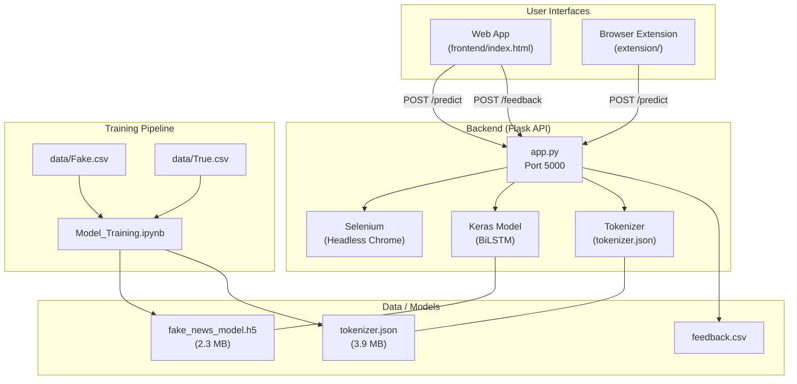

# VeriFact-AI-News-Detector — Complete Project Analysis

## 1. Project Overview

**VeriFact** is a full-stack AI-powered fake news detection system built by **Kushagra Gupta (IIT2023133)**. It classifies news headlines as "Real" or "Fake" using a Bidirectional LSTM neural network trained on ~44,900 articles. The project offers two user-facing frontends (web app + browser extension) backed by a Flask API server.

---

## 2. Architecture Diagram



---

## 3. Component-by-Component Analysis

### 3.1 Model Training ([Model_Training.ipynb](file:///c:/VeriFact-AI-News-Detector/Model_Training.ipynb))

| Aspect | Details |
|--------|---------|
| **Dataset** | Kaggle "Fake and Real News Dataset" — 44,898 samples (balanced) |
| **Feature** | Headline (`title` column) only |
| **Architecture** | `Embedding(10000, 16)` → `SpatialDropout1D(0.2)` → `Bidirectional(LSTM(64))` → `Dense(1, sigmoid)` |
| **Training** | 80/20 train-test split, batch=64, max 10 epochs, EarlyStopping (patience=3) |
| **Result** | **97.92% test accuracy**, loss 0.0585, early-stopped at epoch 3 (best val_loss) |
| **Output** | `fake_news_model.h5` (2.3 MB), `tokenizer.json` (3.9 MB) |

**Notebook structure** (8 cells):
1. Import libraries
2. Load & prepare data (label 0=Fake, 1=Real; use `title` as headline)
3. Data exploration (class distribution plot)
4. Text preprocessing (Tokenizer, padding to `max_length=100`)
5. Train/test split
6. Build BiLSTM model
7. Train with EarlyStopping
8. Evaluate & plot training curves

> [!TIP]
> The training pipeline is clean and well-documented with markdown comments in each cell. The 97.92% accuracy is strong for headline-only classification.

---

### 3.2 Backend ([app.py](file:///c:/VeriFact-AI-News-Detector/backend/app.py))

**Flask server** with 2 endpoints:

#### `POST /predict`
- Accepts JSON with either `headline` (text) or `url` (URL)
- If URL provided → launches **headless Selenium Chrome** to navigate, wait, and extract `<h1>` text
- Tokenizes headline → pads to `max_length=100` → model predicts → returns `{prediction, confidence, headline}`

#### `POST /feedback`
- Accepts `{headline, prediction, feedback}` where feedback is `"correct"` or `"incorrect"`
- Derives the actual label and appends to [feedback.csv](file:///c:/VeriFact-AI-News-Detector/backend/model/feedback.csv)

**Dependencies** ([requirements.txt](file:///c:/VeriFact-AI-News-Detector/backend/requirements.txt)):
```
flask, flask-cors, tensorflow, scikit-learn, pandas, numpy, requests, beautifulsoup4, selenium
```

> [!NOTE]
> `requests` and `beautifulsoup4` are listed but never imported in [app.py](file:///c:/VeriFact-AI-News-Detector/backend/app.py) — likely leftovers from before the Selenium migration.

---

### 3.3 Web Frontend ([index.html](file:///c:/VeriFact-AI-News-Detector/frontend/index.html))

A **single-page application** (486 lines, all-in-one HTML/CSS/JS) with:

| Feature | Implementation |
|---------|---------------|
| **Styling** | Tailwind CSS (CDN), Exo 2 font (Google Fonts), glassmorphism design |
| **Input modes** | Tab toggle: "By Text" (textarea) / "By URL" (input field) |
| **Result display** | Color-coded card (green=real, red=fake), animated confidence bar, percentage |
| **Feedback** | 👍 Correct / 👎 Incorrect buttons → `POST /feedback` |
| **Share** | Copies result text to clipboard |
| **History** | Last 10 analyses saved in `localStorage`, clickable to re-populate |
| **Animations** | Aurora background, gradient text animation, slide-in results, spinner |
| **Navigation** | Anchor-based smooth scroll: Analyzer, How It Works, Contact |

---

### 3.4 Browser Extension ([extension/](file:///c:/VeriFact-AI-News-Detector/extension))

| File | Purpose |
|------|---------|
| [manifest.json](file:///c:/VeriFact-AI-News-Detector/extension/manifest.json) | Manifest V3, permissions: `activeTab`, `scripting`, host: `http://127.0.0.1:5000/*` |
| [background.js](file:///c:/VeriFact-AI-News-Detector/extension/background.js) | Service worker — extracts `<h1>`, calls API, injects result banner |
| `icons/icon48.png` | Extension icon (2.8 MB — very large for a 48px icon!) |

**Flow**: Click icon → inject `getPageHeadline()` to grab `<h1>` text → `POST /predict` → inject `showResultBanner()` with animated slide-down banner (auto-dismiss after 10s).

---

## 4. Strengths ✅

1. **Strong ML performance** — 97.92% accuracy on the test set with a lightweight model
2. **Clean architecture** — Clear separation between training, backend, and frontend
3. **Dual frontend** — Both a polished web UI and a practical browser extension
4. **Selenium scraping** — Handles JS-rendered pages that simple HTTP requests can't
5. **Feedback loop** — Users can correct predictions, building a retraining dataset
6. **Modern UI design** — Glassmorphism, animated gradients, smooth transitions
7. **Persistent history** — LocalStorage-based analysis history in the web app
8. **Error handling** — Graceful degradation with error banners in the extension
9. **Well-documented** — Comprehensive README with setup instructions
10. **Training reproducibility** — Notebook with outputs preserved, random_state fixed

---

## 5. Issues & Improvement Opportunities ⚠️

### 5.1 Security & Production Readiness

| Issue | Severity | Details |
|-------|----------|---------|
| **Debug mode in production** | 🔴 High | [app.py:138](file:///c:/VeriFact-AI-News-Detector/backend/app.py#L138): `debug=True` exposes the Werkzeug debugger, allowing remote code execution |
| **No input validation/sanitization** | 🔴 High | URLs and headlines are processed without validation — potential SSRF via Selenium (can access internal network resources) |
| **No rate limiting** | 🟡 Medium | The Selenium endpoint is resource-intensive; no protection against abuse |
| **CORS is fully open** | 🟡 Medium | [app.py:19](file:///c:/VeriFact-AI-News-Detector/backend/app.py#L19): `CORS(app)` allows all origins |
| **No HTTPS** | 🟡 Medium | All communication is over plain HTTP |
| **ChromeDriver bundled** | 🟡 Medium | 19 MB binary in the repo; version will become stale vs. Chrome updates |

### 5.2 Code Quality

| Issue | Severity | Details |
|-------|----------|---------|
| **Unused dependencies** | 🟢 Low | `requests` and `beautifulsoup4` in requirements.txt but not used in code |
| **Deprecated clipboard API** | 🟡 Medium | [index.html:439](file:///c:/VeriFact-AI-News-Detector/frontend/index.html#L439): `document.execCommand('copy')` is deprecated; should use `navigator.clipboard.writeText()` |
| **Missing `<meta>` description** | 🟢 Low | No SEO meta description tag in the HTML `<head>` |
| **Hardcoded API URL** | 🟡 Medium | `http://127.0.0.1:5000` is hardcoded in both frontend and extension — not configurable |
| **No unit/integration tests** | 🟡 Medium | No test suite for backend or frontend |
| **Giant icon file** | 🟢 Low | `icon48.png` is 2.8 MB for a 48x48 icon — should be a few KB at most |

### 5.3 ML / Model Concerns

| Issue | Severity | Details |
|-------|----------|---------|
| **Dataset bias** | 🟡 Medium | Trained on political news from a specific era (2015-2018); may not generalize to current or non-political news |
| **Headlines only** | 🟡 Medium | Only analyzes titles, not article body — can be fooled by well-crafted fake headlines |
| **No retraining pipeline** | 🟡 Medium | Feedback.csv is collected but no automated retraining workflow exists |
| **Binary classification** | 🟢 Low | No "uncertain" category — everything is forced into real/fake |
| **`.h5` format** | 🟢 Low | Keras `.h5` is legacy; TF SavedModel format is recommended for production |
| **No model versioning** | 🟢 Low | No tracking of model versions/experiments |

### 5.4 UX / Frontend

| Issue | Severity | Details |
|-------|----------|---------|
| **Footer copyright** | 🟢 Low | Says "© 2025" — should be 2026 or dynamic |
| **Social links are `#`** | 🟢 Low | Twitter/Facebook/Instagram links in the footer go nowhere |
| **Tab switching bug** | 🟢 Low | [index.html:454](file:///c:/VeriFact-AI-News-Detector/frontend/index.html#L454): `tabUrl.classList.remove('active', 'text-slate-400')` then immediately re-adds `text-slate-400` — no functional impact but redundant |
| **No mobile responsiveness for extension** | 🟢 Low | Extension is desktop-only (Chrome/Edge) |
| **Alert-based errors** | 🟡 Medium | Uses `alert()` for error messages — should use inline UI notifications |

### 5.5 Selenium / URL Scraping

| Issue | Severity | Details |
|-------|----------|---------|
| **Resource leak risk** | 🟡 Medium | If an exception occurs between `webdriver.Chrome()` and `driver.quit()`, the browser process leaks. Should use `try/finally` or context manager |
| **Only extracts first `<h1>`** | 🟢 Low | Some pages use `<h2>` or `<article>` headers for the main headline |
| **No URL allowlisting** | 🟡 Medium | Can be used to scrape any URL, including internal network addresses |
| **Blocking operation** | 🟡 Medium | Selenium scraping blocks the Flask thread — with multiple concurrent requests, this becomes a bottleneck |

---

## 6. File-Level Summary

| File | Lines | Size | Purpose |
|------|-------|------|---------|
| [README.md](file:///c:/VeriFact-AI-News-Detector/README.md) | 162 | 8.3 KB | Project documentation |
| [Model_Training.ipynb](file:///c:/VeriFact-AI-News-Detector/Model_Training.ipynb) | 574 | 94.9 KB | ML training pipeline (Jupyter) |
| [backend/app.py](file:///c:/VeriFact-AI-News-Detector/backend/app.py) | 139 | 5.5 KB | Flask API server |
| [backend/requirements.txt](file:///c:/VeriFact-AI-News-Detector/backend/requirements.txt) | 9 | 86 B | Python dependencies |
| [backend/model/fake_news_model.h5](file:///c:/VeriFact-AI-News-Detector/backend/model/fake_news_model.h5) | — | 2.3 MB | Trained Keras model |
| [backend/model/tokenizer.json](file:///c:/VeriFact-AI-News-Detector/backend/model/tokenizer.json) | — | 3.9 MB | Fitted tokenizer |
| [backend/model/feedback.csv](file:///c:/VeriFact-AI-News-Detector/backend/model/feedback.csv) | 5 | 236 B | User feedback data |
| [backend/chromedriver.exe](file:///c:/VeriFact-AI-News-Detector/backend/chromedriver.exe) | — | 19.3 MB | Selenium WebDriver |
| [frontend/index.html](file:///c:/VeriFact-AI-News-Detector/frontend/index.html) | 486 | 27.9 KB | Web application (SPA) |
| [frontend/images/logo.png](file:///c:/VeriFact-AI-News-Detector/frontend/images/logo.png) | — | 59 KB | Logo image |
| [extension/manifest.json](file:///c:/VeriFact-AI-News-Detector/extension/manifest.json) | 25 | 474 B | Extension config (Manifest V3) |
| [extension/background.js](file:///c:/VeriFact-AI-News-Detector/extension/background.js) | 184 | 6.7 KB | Extension service worker |
| [extension/icons/icon48.png](file:///c:/VeriFact-AI-News-Detector/extension/icons/icon48.png) | — | 2.8 MB | Extension icon (oversized) |
| [.gitignore](file:///c:/VeriFact-AI-News-Detector/.gitignore) | 15 | 230 B | Git ignore rules |

---

## 7. Tech Stack Summary

| Layer | Technology |
|-------|-----------|
| **ML Framework** | TensorFlow/Keras |
| **Model** | Bidirectional LSTM (Embedding → SpatialDropout1D → BiLSTM → Dense) |
| **Backend** | Python 3.8+, Flask, Flask-CORS |
| **Web Scraping** | Selenium + ChromeDriver (headless) |
| **Frontend** | HTML5, Tailwind CSS (CDN), Vanilla JavaScript |
| **Extension** | Chrome Manifest V3, Service Worker |
| **Training** | Jupyter Notebook, Pandas, scikit-learn, matplotlib, seaborn |
| **Data Storage** | CSV (feedback), JSON (tokenizer), HDF5 (model) |

---

## 8. Recommended Priority Improvements

### Immediate (High Priority)
1. **Disable debug mode** — Change `debug=True` to `debug=False` in [app.py:138](file:///c:/VeriFact-AI-News-Detector/backend/app.py#L138)
2. **Add `try/finally` to Selenium** — Ensure `driver.quit()` runs even on exceptions
3. **URL validation** — Validate and sanitize URLs before passing to Selenium (whitelist schemes, block private IPs)

### Short-term
4. **Add rate limiting** — Use `flask-limiter` to protect the `/predict` endpoint
5. **Replace `alert()` with inline notifications** — Better UX for error states
6. **Fix the oversized icon** — Compress `icon48.png` from 2.8 MB to a few KB
7. **Remove unused dependencies** — Drop `requests` and `beautifulsoup4` from requirements
8. **Use modern clipboard API** — Replace `document.execCommand('copy')` with `navigator.clipboard.writeText()`

### Long-term
9. **Add a test suite** — Backend unit tests with pytest, frontend tests with a test runner
10. **Model versioning** — Track experiments with MLflow or similar
11. **Automated retraining** — Use accumulated feedback.csv to periodically retrain
12. **Deploy properly** — Use gunicorn/uWSGI behind nginx, add HTTPS
13. **Consider Transformer models** — BERT/DistilBERT may improve generalization to modern news

---

## 9. Conclusion

VeriFact is a **well-structured, functional full-stack ML project** that demonstrates strong end-to-end skills: from data preprocessing and model training to API development, web design, and browser extension development. The 97.92% test accuracy, polished UI with glassmorphism design, and dual-frontend approach are notable strengths. The primary areas for improvement are around **security hardening** (debug mode, SSRF protection), **production readiness** (proper WSGI server, HTTPS, rate limiting), and **ML robustness** (dataset diversity, retraining pipeline).
